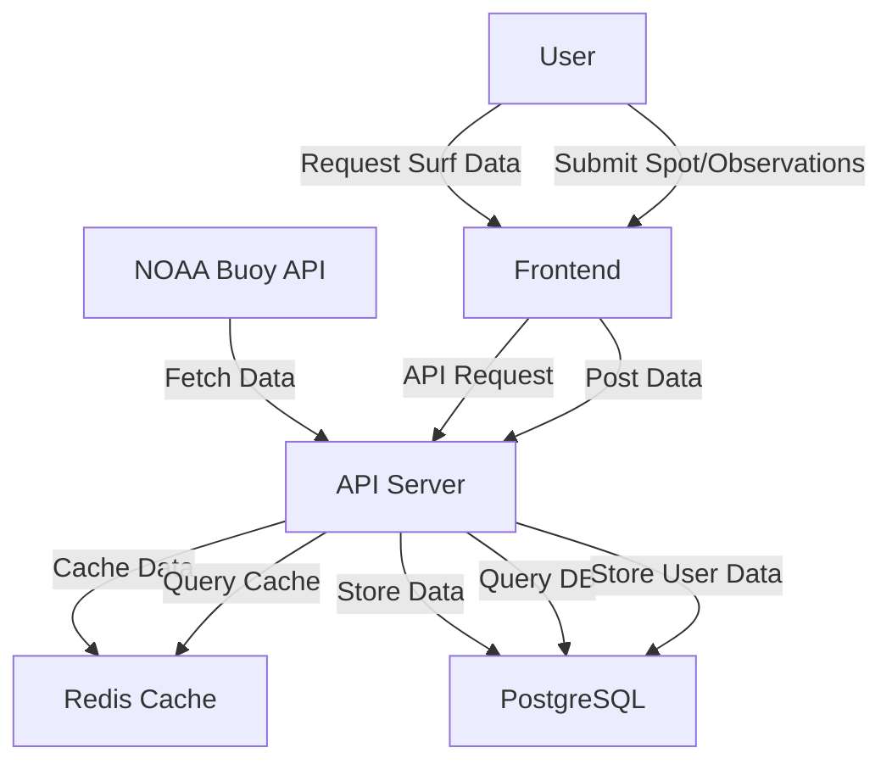
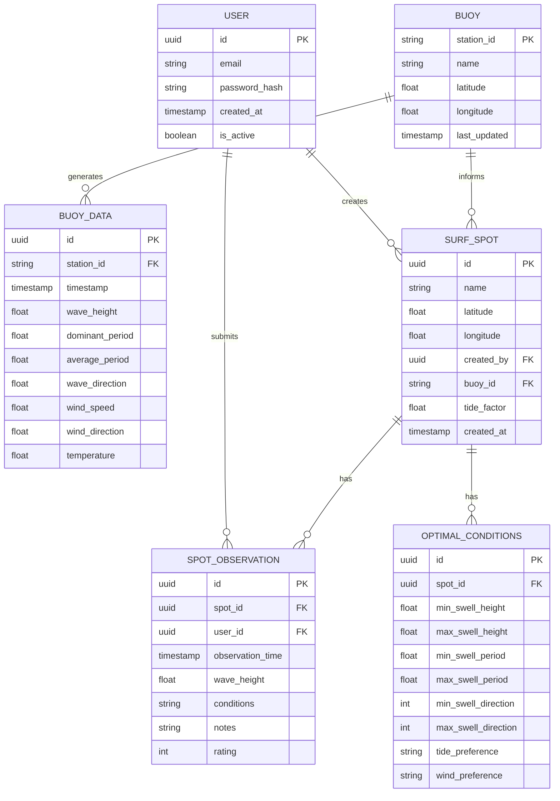
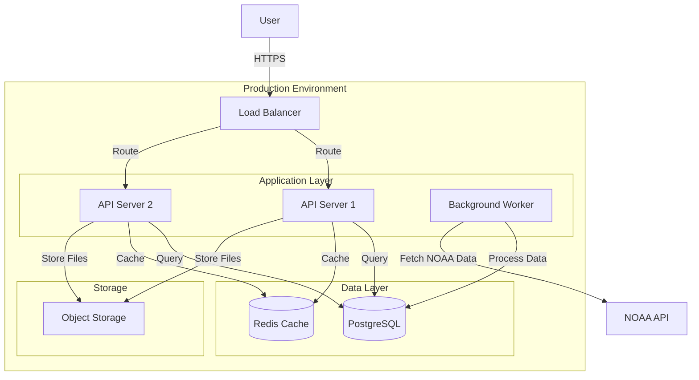
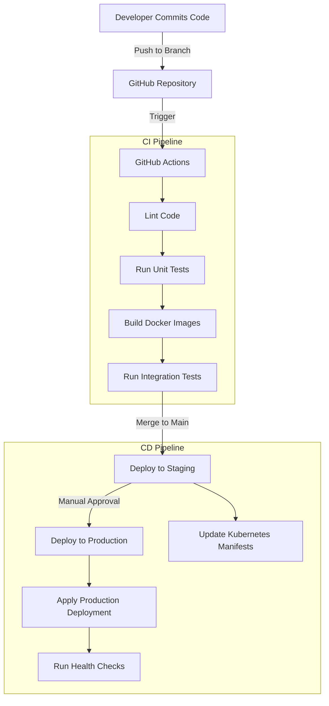
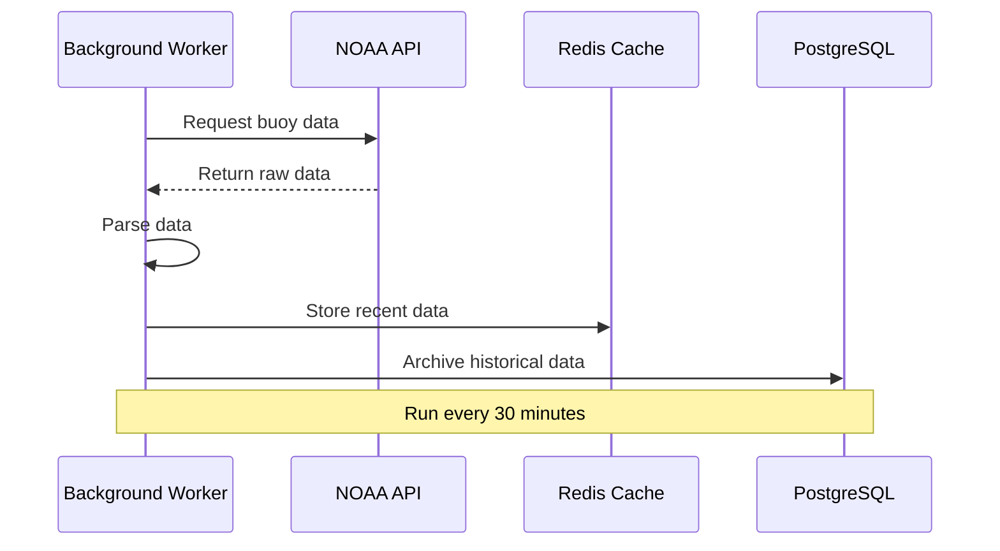

# Hawaii Surf App Architecture Document

## Overview

This document outlines the architecture for a Hawaii-focused surf forecasting application that combines NOAA buoy data with user-generated insights. The application will initially focus on Maui with the goal of expanding to other Hawaiian islands.

## System Goals

1. Display near real-time surf conditions based on NOAA buoy data
2. Allow users to create "surf spots" tied to geographical locations
3. Enable users to log observations and optimal conditions for each spot
4. Implement progressive wave modeling capabilities:
   - Simple buoy data display
   - 2D shadow/refraction modeling
   - Advanced bathymetry-based modeling

## Development Phases

### Phase 1: Core Features and User Validation
- Basic user authentication
- NOAA buoy data integration
- Surf spot creation and management
- User observations and condition notes

### Phase 2: Enhanced Forecasting
- 2D shadow line/wave refraction modeling
- Tide integration
- Historical data analysis
- Improved spot recommendations

### Phase 3: Advanced Modeling
- Bathymetry-based wave forecasting
- Machine learning from user observations
- Comprehensive forecast system

## System Architecture

The system will follow a modern microservices architecture with:
- FastAPI backend (RESTful API)
- PostgreSQL database
- Redis cache for buoy data
- Modern frontend (React/Vue/Angular)
- Docker containerization
- CI/CD pipeline

### Data Flow



## Entity Relationship Diagram



## API Endpoints

### Authentication
- `POST /api/auth/register` - User registration
- `POST /api/auth/login` - User login
- `POST /api/auth/refresh` - Refresh token

### Buoy Data
- `GET /api/buoys` - List all buoys
- `GET /api/buoys/{station_id}` - Get specific buoy info
- `GET /api/buoys/{station_id}/data` - Get buoy readings
- `GET /api/buoys/{station_id}/data/latest` - Get latest reading

### Surf Spots
- `GET /api/spots` - List all surf spots
- `POST /api/spots` - Create new surf spot
- `GET /api/spots/{spot_id}` - Get spot details
- `PUT /api/spots/{spot_id}` - Update spot details
- `DELETE /api/spots/{spot_id}` - Delete spot

### Observations
- `GET /api/spots/{spot_id}/observations` - List observations for spot
- `POST /api/spots/{spot_id}/observations` - Create observation
- `GET /api/spots/{spot_id}/optimal-conditions` - Get optimal conditions
- `POST /api/spots/{spot_id}/optimal-conditions` - Set optimal conditions

## Database Schema

### Tables

1. `users`
   - id (UUID, PK)
   - email (VARCHAR, unique)
   - password_hash (VARCHAR)
   - created_at (TIMESTAMP)
   - is_active (BOOLEAN)

2. `buoys`
   - station_id (VARCHAR, PK)
   - name (VARCHAR)
   - latitude (FLOAT)
   - longitude (FLOAT)
   - last_updated (TIMESTAMP)

3. `buoy_data`
   - id (UUID, PK)
   - station_id (VARCHAR, FK)
   - timestamp (TIMESTAMP)
   - wave_height (FLOAT)
   - dominant_period (FLOAT)
   - average_period (FLOAT)
   - wave_direction (FLOAT)
   - wind_speed (FLOAT)
   - wind_direction (FLOAT)
   - temperature (FLOAT)

4. `surf_spots`
   - id (UUID, PK)
   - name (VARCHAR)
   - latitude (FLOAT)
   - longitude (FLOAT)
   - created_by (UUID, FK)
   - buoy_id (VARCHAR, FK)
   - tide_factor (FLOAT)
   - created_at (TIMESTAMP)

5. `spot_observations`
   - id (UUID, PK)
   - spot_id (UUID, FK)
   - user_id (UUID, FK)
   - observation_time (TIMESTAMP)
   - wave_height (FLOAT)
   - conditions (VARCHAR)
   - notes (TEXT)
   - rating (INTEGER)

6. `optimal_conditions`
   - id (UUID, PK)
   - spot_id (UUID, FK)
   - min_swell_height (FLOAT)
   - max_swell_height (FLOAT)
   - min_swell_period (FLOAT)
   - max_swell_period (FLOAT)
   - min_swell_direction (INTEGER)
   - max_swell_direction (INTEGER)
   - tide_preference (VARCHAR)
   - wind_preference (VARCHAR)

## Technology Stack

### Backend
- **Framework**: FastAPI
- **Database**: PostgreSQL
- **Cache**: Redis
- **Authentication**: JWT
- **Data Processing**: Pandas/NumPy

### DevOps
- **Containerization**: Docker
- **CI/CD**: GitHub Actions
- **Deployment**: Kubernetes or AWS ECS

### Infrastructure Diagram



## Docker Compose Setup

```yaml
version: '3.8'

services:
  api:
    build: ./backend
    ports:
      - "8000:8000"
    environment:
      - DATABASE_URL=postgresql://postgres:password@db:5432/surfapp
      - REDIS_URL=redis://cache:6379/0
    depends_on:
      - db
      - cache
    volumes:
      - ./backend:/app

  db:
    image: postgres:14
    volumes:
      - postgres_data:/var/lib/postgresql/data/
    environment:
      - POSTGRES_PASSWORD=password
      - POSTGRES_USER=postgres
      - POSTGRES_DB=surfapp
    ports:
      - "5432:5432"

  cache:
    image: redis:alpine
    ports:
      - "6379:6379"
    volumes:
      - redis_data:/data

  worker:
    build:
      context: ./backend
      dockerfile: Dockerfile.worker
    environment:
      - DATABASE_URL=postgresql://postgres:password@db:5432/surfapp
      - REDIS_URL=redis://cache:6379/0
    depends_on:
      - db
      - cache

volumes:
  postgres_data:
  redis_data:
```

## Development Guidelines

### Code Organization

```
project/
├── backend/
│   ├── app/
│   │   ├── api/
│   │   │   ├── endpoints/
│   │   │   │   ├── auth.py
│   │   │   │   ├── buoys.py
│   │   │   │   ├── spots.py
│   │   │   │   └── observations.py
│   │   │   └── deps.py
│   │   ├── core/
│   │   │   ├── config.py
│   │   │   └── security.py
│   │   ├── db/
│   │   │   ├── base.py
│   │   │   └── session.py
│   │   ├── models/
│   │   │   ├── user.py
│   │   │   ├── buoy.py
│   │   │   └── spot.py
│   │   ├── schemas/
│   │   │   ├── user.py
│   │   │   ├── buoy.py
│   │   │   └── spot.py
│   │   ├── services/
│   │   │   ├── buoy_service.py
│   │   │   └── forecast_service.py
│   │   └── main.py
│   ├── alembic/
│   │   └── versions/
│   ├── tests/
│   │   ├── api/
│   │   └── services/
│   ├── Dockerfile
│   ├── Dockerfile.worker
│   └── requirements.txt
├── frontend/
│   ├── src/
│   │   ├── components/
│   │   ├── pages/
│   │   ├── services/
│   │   └── App.js
│   ├── public/
│   └── package.json
├── docker-compose.yml
└── README.md
```

### CI/CD Pipeline



## NOAA Data Integration

### Buoy Data Retrieval Process



### Key Buoy Parameters to Store

- Wave height (WVHT)
- Dominant wave period (DPD)
- Average wave period (APD)
- Wave direction (MWD)
- Wind speed (WSPD)
- Wind direction (WDIR)
- Water temperature (WTMP)

## User Data Collection Strategy

For the user validation approach, collect:

1. **Subjective ratings** (1-5 stars) of spot quality
2. **Observed conditions**:
   - Actual wave height (face height)
   - Break type (hollow, mushy, etc.)
   - Crowd factor
   - Wind effects
3. **Correlations** with buoy data:
   - Which swell directions work best
   - Optimal swell period ranges
   - Tide dependencies

## Wave Modeling Progression

### Phase 1: Direct Buoy Correlation
- Use nearest buoy data with minimal processing
- Allow users to select which buoy best represents their spot

### Phase 2: Shadow Line / Refraction Model
- Implement basic island shadow calculations
- Account for swell wrapping around land masses
- Apply simple refraction principles at headlands

### Phase 3: Bathymetry Model
- Incorporate depth charts for Maui coastal waters
- Model wave transformations over varying depths
- Calculate shoaling and breaking characteristics

## Conclusion

This architecture provides a solid foundation for building a Hawaiian surf forecasting application with progressive enhancement capabilities. By starting with user validation and basic buoy data, then expanding to more sophisticated modeling techniques, the application can deliver value quickly while establishing a path for continuous improvement.
